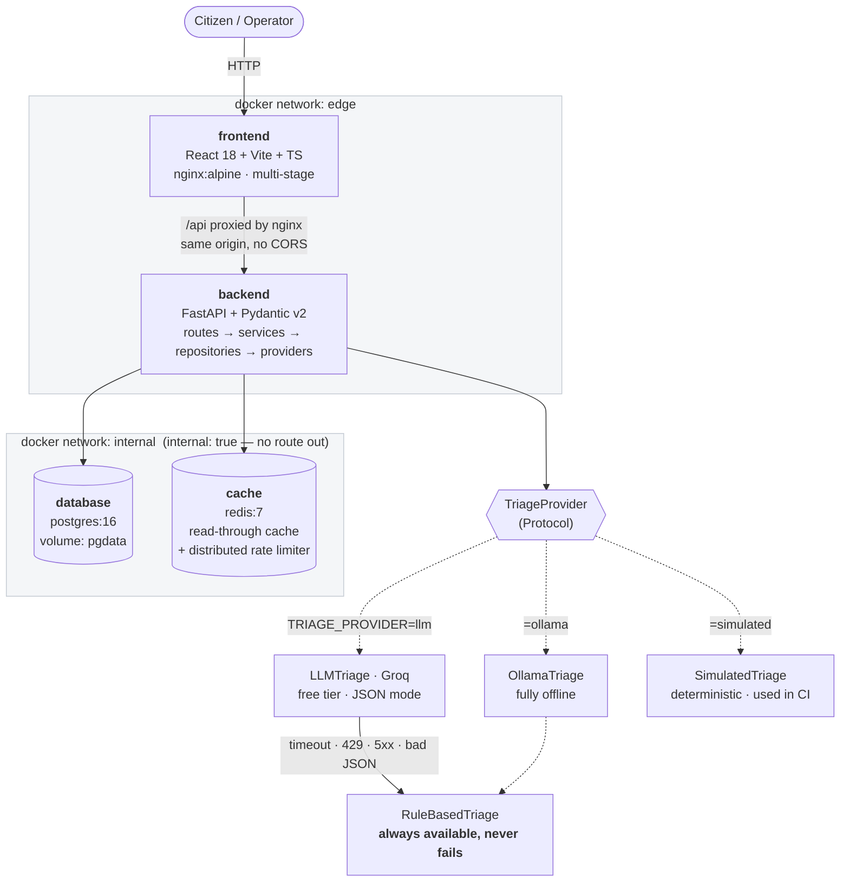
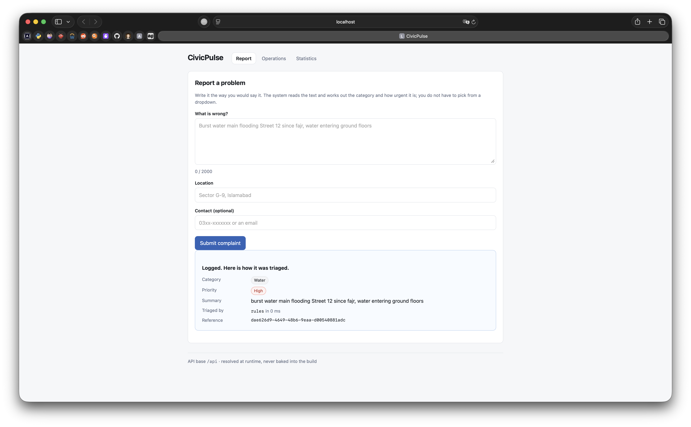
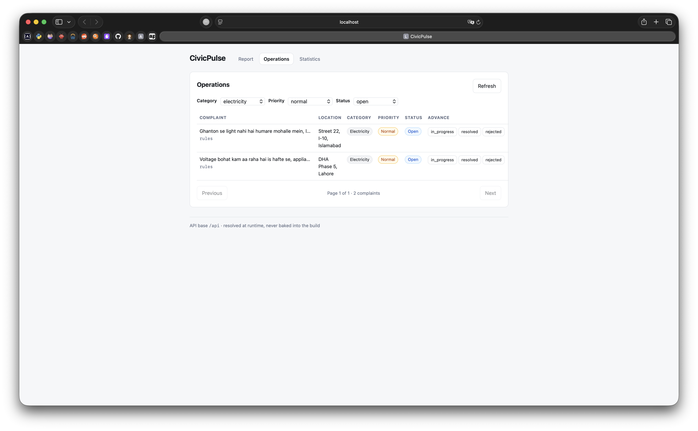
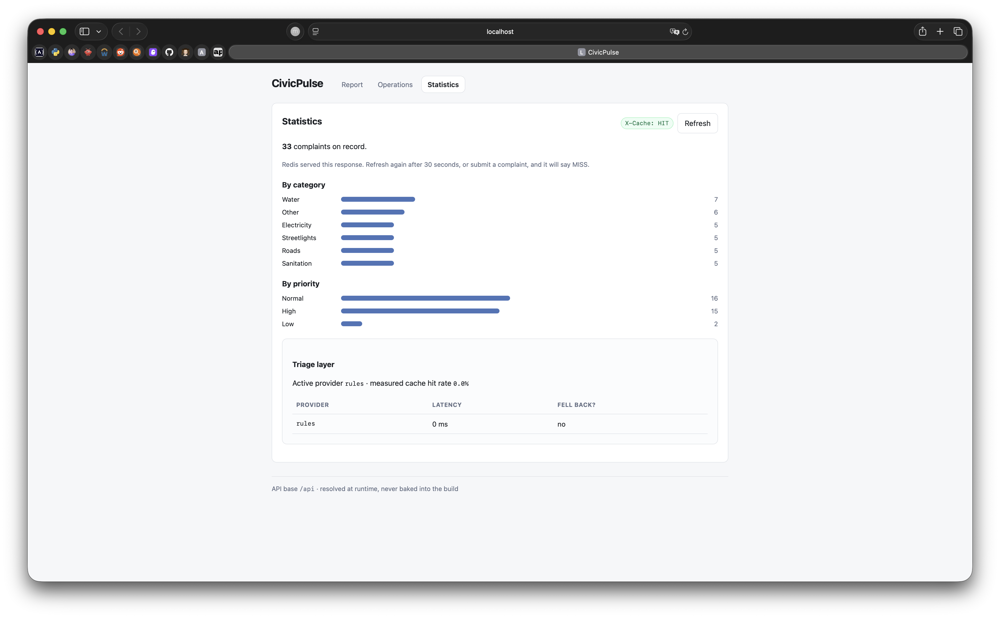

# CivicPulse

[](https://github.com/Umm-e-SulaimRana/scd_assignment1/actions/workflows/ci.yml)
[](https://github.com/Umm-e-SulaimRana/scd_assignment1/actions/workflows/cd.yml)


Municipal complaint intake, triage and operations — as a system that does not
fall over when the clever part does.

**CS4032 Software Construction and Design · Assignment 01**
Umme Sulaim (24I-3062) · Eiman Wasim (24I-3081)

---

## The problem

A citizen reports *"burst water main flooding Street 12 since fajr, water
entering ground floors"* into a form. It lands in an undifferentiated queue,
four hundred items long on a Monday, sitting behind three streetlight
complaints because nothing sorted them. By the time a human reads it, a
street is flooded.

Making the citizen pick a category from a dropdown does not fix this — people
pick wrong, pick "Other" to get through the form faster, and cannot judge
urgency. The information is in the text. Somebody has to read it.

So the engineering problem is not the reading. **It is that the reader must be
replaceable.** Today it is a keyword rule. Tomorrow a language model. Next
year a fine-tuned classifier. The system around it must not care which, and
must not fall over when the clever one is rate-limited, slow, or simply
wrong.

CivicPulse is that system: a React frontend, a FastAPI backend behind a
swappable `TriageProvider` interface, PostgreSQL for durability, Redis doing
cache *and* distributed rate limiting, five containers on two segmented
networks, and a Kubernetes deployment that autoscales and rolls back.

## Architecture



`frontend` is on `edge` only. `database` and `cache` are on `internal` only,
which has `internal: true` and therefore no route to the outside world.
`backend` is the single service on both, and is the only path to the data.
`docker compose exec frontend ping database` **fails**, by design —
`scripts/prove-isolation.sh` asserts it and CI fails the build if it ever
starts working.

## Quickstart

From a clean clone, on a machine with Docker and Docker Compose:

```bash
git clone https://github.com/Umm-e-SulaimRana/scd_assignment1.git civicpulse && cd civicpulse
cp .env.example .env
docker compose up -d --build

# wait for the backend to report both dependencies reachable
until curl -fsS http://localhost:8000/ready; do sleep 2; done

docker compose exec backend alembic upgrade head
docker compose exec backend python -m scripts.seed      # 32 complaints, idempotent
```

Open <http://localhost:8080>.

That works with no API key: `.env.example` ships `TRIAGE_PROVIDER=rules`, the
deterministic local classifier. To use a real model, put a free Groq key in
`.env` (`GROQ_API_KEY=`), set `TRIAGE_PROVIDER=llm`, and
`docker compose up -d backend`.

Tear down with `docker compose down` (data survives) or `docker compose down -v`
(data does not).

### On Kubernetes

```bash
k3d cluster create civicpulse -p "8080:80@loadbalancer"
kubectl apply -f https://raw.githubusercontent.com/kubernetes/ingress-nginx/controller-v1.11.3/deploy/static/provider/cloud/deploy.yaml
kubectl apply -f https://github.com/kubernetes-sigs/metrics-server/releases/download/v0.7.2/components.yaml

docker build -t civicpulse-backend:dev ./backend
docker build -t civicpulse-frontend:dev ./frontend
k3d image import civicpulse-backend:dev civicpulse-frontend:dev -c civicpulse

kubectl apply -k k8s/overlays/dev
kubectl -n civicpulse rollout status deployment/backend --timeout=300s
```

Add `127.0.0.1 civicpulse.local` to `/etc/hosts`, then open
<http://civicpulse.local:8080>.

## API

| Method | Path | Behaviour |
|---|---|---|
| `POST` | `/api/complaints` | Validate → triage → persist. `201`. `400` with a field-level body; `429` with `Retry-After` past the rate limit. |
| `GET` | `/api/complaints/{id}` | `200` / `404` |
| `GET` | `/api/complaints` | Filter by category, priority, status; paginate (`page`, `page_size` ≤ 100); returns `total`. |
| `PATCH` | `/api/complaints/{id}/status` | Enforces the state machine. Invalid transition → `409` **naming the attempted transition**. |
| `GET` | `/api/stats` | Aggregates, Redis-cached, TTL 30 s, `X-Cache: HIT\|MISS`. |
| `GET` | `/api/meta/providers` | Active provider, measured triage cache hit rate, last 20 outcomes with latency and whether each fell back. |
| `GET` | `/health` | Liveness. **Never touches the database.** |
| `GET` | `/ready` | Readiness. `200` only if Postgres *and* Redis are reachable; `503` naming the failure. |
| `GET` | `/metrics` | Prometheus: request count, latency histogram, triage latency, fallback counter. |

Interactive schema at <http://localhost:8000/docs>.

**Status state machine.** `open → in_progress → resolved`; `open → rejected`;
`in_progress → rejected`. `resolved` and `rejected` are terminal. Everything
else is a `409`. It is an explicit transition table in
`backend/app/services/state_machine.py`, not a chain of ifs, and the frontend
does not duplicate it — one source of truth.

## Repository layout

```
frontend/          React 18 + Vite + TypeScript, nginx multi-stage image
backend/           FastAPI, four layers: routes → services → repositories → providers
k8s/               Kustomize: base/ + overlays/dev + overlays/prod
.github/workflows/ ci.yml · cd.yml · release.yml
scripts/           isolation proof, build-context and image measurements, k6 load test
docs/adr/          four architecture decision records
docs/RUNBOOK.md    deploy, roll back, read logs, what to do when triage fails
docs/ENGINEERING-NOTES.md   the eight questions from §5.2
compose.yaml       dev: build:, bind mount, published backend port
compose.prod.yaml  prod: image: ${IMAGE_TAG}, no build:, no published DB or cache port
```

## Design decisions worth reading

| ADR | Decision |
|---|---|
| [0001](docs/adr/0001-triage-provider-interface.md) | Why triage sits behind a `Protocol` with four implementations |
| [0002](docs/adr/0002-frontend-runtime-config.md) | Why the frontend reads its config at runtime, not build time |
| [0003](docs/adr/0003-deploy-by-sha.md) | Deploy by immutable reference; where `internal: true` leaves the LLM call |
| [0004](docs/adr/0004-pii-and-data-governance.md) | What leaves the machine, to whom, and why that is acceptable |

## Tests

```bash
cd backend  && pip install -r requirements-dev.txt && python -m pytest --cov=app
cd frontend && npm ci && npm test
```

CI additionally brings the whole stack up, posts a real complaint, reads it
back, asserts `X-Cache` goes `MISS → HIT`, asserts an illegal transition is a
`409` naming itself, asserts the frontend **cannot** reach the database, and
asserts `down` then `up` preserves every row.

## Screenshots

| | |
|---|---|
|  |  |
| Submit view — category, priority, summary and provider, as returned | Operations — filters, pagination, the server's 409 verbatim |
|  |  |
| Stats — aggregates plus the live `X-Cache` state | HPA scaling out under k6 load |

## Licence

MIT.
